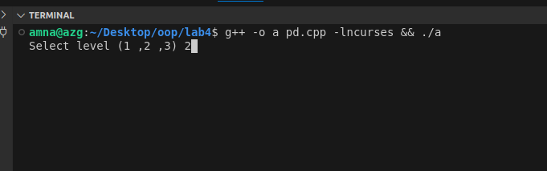
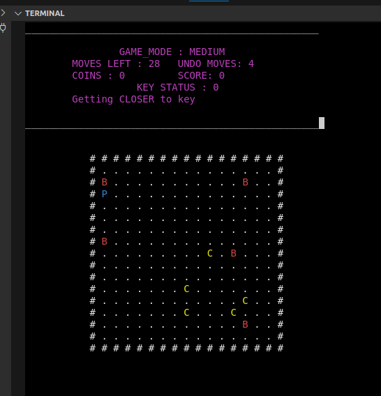
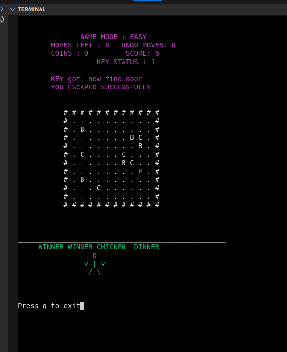
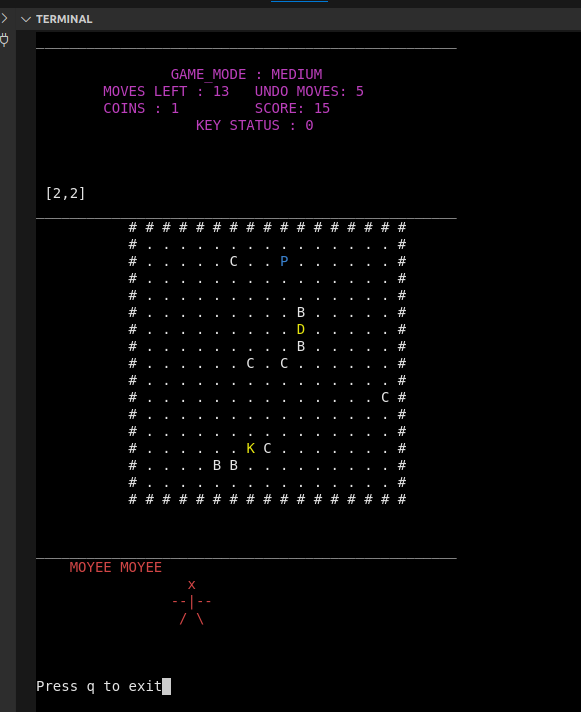

##

#  Data Structures

# The Unseen Journey Quest

Maze Adventure is a terminal-based puzzle game where the player navigates through a maze, collects coins, avoids bombs, finds the key, and escapes through the door. The game offers three difficulty levels, each with different grid sizes,limit undo moves and move limits.

## Table of Contents

- [Introduction](#introduction)
- [Features](#features)
- [Game Mechanics](#game-mechanics)
- [Installation](#installation)
- [Running the Game](#running-the-game)
- [Screenshots](#screenshots)
- [Dependencies](#dependencies)
- [Configuration](#configuration)
- [Troubleshooting](#troubleshooting)

## Introduction

In Maze Adventure, players must explore a randomly generated maze, collecting coins and avoiding bombs. The objective is to find the key and then the door to escape.The player first finds the key and then, can escape from door. The game is played directly in the terminal using arrow keys to move and includes an undo feature to revert your previous moves.

## Features

- Three difficulty levels: Easy, Medium, and Hard
- A maze with random key, door, coin, and bomb placements
- Player movement with limited moves per level
- Undo functionality for retracting previous moves
- Sensing system to give hints on proximity to the key or door
- A scoring system to track progress and performance
- A game over screen with option to quit
- A menu to select difficulty level and start the game
- Labels on screen that display player progress throughout the game
- Real-time update of coins and bombs

## Game Mechanics

- **Player Moves**: The player uses the arrow keys to move in the maze.
- **Coins**: Collect coins scattered around the maze to increase score and undo moves.
- **Bombs**: Avoid bombs placed randomly in the maze.
- **Undo**: Press `u` to undo the last move. Undo count is limited.
- **Key**: Find the key before attempting to open the door.
- **Door**: After collecting the key, locate the door to escape the maze and win.
- **Sensing System**: The game provides hints on proximity to the key or door.
- **Quit**: Press `q` to exit the game at any time.

## Installation

1. Ensure you have `g++` and the `ncurses` library installed on your system.

   For Ubuntu/Debian:

   ```bash
   sudo apt-get install g++
   sudo apt-get install libncurses5-dev libncursesw5-dev
   ```

## Running the Game

2. Compile the game using the provided command:

   ```bash
   g++ -o maze_game DS_C_i232556.cpp -lncurses

   ```

3. To run the game follow these commands:

   ```bash
   ./maze_game
   ```



4. You will be prompted to choose the difficulty level:

- 1 for Easy (10x10 grid)
- 2 for Medium (15x15 grid)
- 3 for Hard (20x20 grid)

5. Use the arrow keys to move around the maze. The game will display real-time feedback about your proximity to the key or door and keep track of your score and moves.
6. To undo a move, press u.
7. Press q to quit the game.
8. The game ends when you find the key and open the door or when you run out of moves

## Screenshots

- Initial Stage. . . . . . . . . . .. . . . . . . . . . . .. . . . . .
  

- When You Win! after successfully collecting key and exiting
  

- When You lose. This appears . . . . . . .. . . . . . . .. . . . . . .
  

## Dependencies

- ncurses: Used to handle terminal input and output, such as rendering the maze and managing player movement.
- g++: The game is written in C++ and requires a C++ compiler to build.
- Ubuntu/Debian: The game has been tested on Ubuntu/Debian systems.

## Configuration

- The game configuration such as grid size, number of undo moves, and player moves are determined by the selected difficulty level by modifying the `grid` variable:

  - Easy: 10x10 grid, 6 moves, 6 undo moves
  - Medium: 15x15 grid, 4 moves, 4 undo moves
  - Hard: 20x20 grid, 1 move, 1 undo move

## Troubleshooting

- If you encounter any issues during compilation or execution, ensure that you have the necessary dependencies installed and
- ncurses errors: If the game fails to run and mentions missing ncurses libraries, ensure that ncurses is installed properly.
- Invalid input: If you enter an invalid level at the start, you'll be asked to select again.

##
